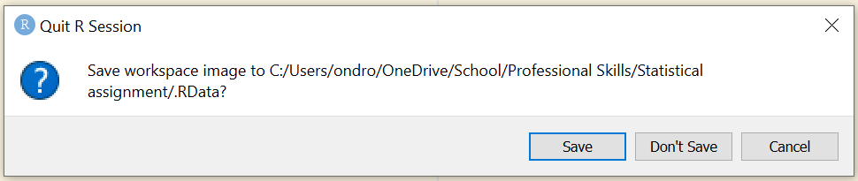

# Mastering RStudio: Tips and tricks to become a professional codeR
**Fast and efficient use of smart packages and RStudio workspace**
with soundtrack from Tame Impala

This tutorial was designed to help you to boost your confidence in R and RStudio by showing you how you can use RStudio to its full potential with simple tips, tricks and shortcuts, that are available either in RStudio itself or in several practical packages.

### Why do you need this?

Let me start by saying that R is not the easiest coding language to learn and it might be that just like the rest of us, you are struggling to get a grip on it and need a little boost to help you learn to love it and maybe even make it a little bit of fun. The RStudio is an opensource software used increasingly in data science, but especially because of the characteristics and specificities of the language (don't use spaces in your file names!) is known to drive people crazy, frustrated and overwhelmed - and you might not be the exception! Your workspace may look too busy for you to concentrate or you just want to be a little faster in your command, so you can focus on the actual analysis you were supposed to do in the first place... right?

While these tips will not necessarily give you all the quantitative skills to become an experienced data scientist, they will make you feel like one, which is only a step away from the final transformation. With a little bit of luck, this tutorial will make coding less overwhelming and way more enjoyable. The material that I will be sharing are mostly quick fixes to make coding smoother and faster and if it gets too much at any point, you can stop and come back to it when you have more energy! This means the tutorial is friendly for all kinds of working patterns and above all should give you motivation along your coding journey, whether you're a beginner or an experienced coder. It's designed as a resource to help you, so you can work through it on your own terms, one step at a time.

The tutorial is introductory level and can be useful to you even if you have only started on your R language learning journey, but contains information that can be useful even for intermediate or advanced R users! I organized the tutorial in order of importance from most important to least (to get your full attention for the essential part!), but everyone's needs are different, so **feel free to skip directly to any of the parts that you think will be most useful to you!**

Specify what version of R im using

Outline:
- Organizing your RStudio workspace for convenience
  - Make your script pane larger
  - Set RStudio to never save your workspaceimage
  -
- Using built in shortcuts
- Useful packages
- Keyboard shortcuts

- Bonus: personalization

**(can i toggle different sections?)**

### 1. Organizing your RStudio workspace for convenience

#### a) Make your script pane larger
Let's begin by making your RStudio feel a bit more homey! If you ask me, the original look of the panes all squished together with little space to write in and even less to see is not ideal. Thankfully we can adjust it to work around our needs using

Navigate to the upper panel, click on tools and choose "Global options..."

...and this window will pop up.

You can organize your panes to best suit you, but I have found that when I put the console to the upper right corner, and move the everything else in the lower left panel, with only history on the bottom right, I get a lot more space to write my script and see the console at the same time. The history panel is rarely used, so we can minimize it and enjoy the extra space!

By the way, you might have noticed the theme of my RStudio is yellow! This is not essential nor good for effective use of RStudio, but a personalized space will always be more enjoyable to work in! See the Extras for multiple ways to personalize your RStudio!

#### b) Set RStudio to never save your workspace image
One of the things you know, or will undoubtly learn along your R journey, is that the best way to go around saving your work is to save your script either on your computer or even better online using version control such as Github (**click here for a guide on version control**).  
When you save the script, you don't have to save the image of your workplace (i.e. everything in the console) which can take up unnecessary space on your computer.

When this image appears on your screen, you can just press "Don't save", but let me tell you, you will get annoyed by this [eventually](https://youtu.be/GHe8kKO8uds?t=94)... Which is why you can set your RStudio to never ask this again!

Bonus: If you're an experienced user of R and are frequently using it to create beautiful visualizations that you've learnt in one of the Our Coding Club tutorials or elsewhere, it might be useful for you to create an R profile.

Extra: Personalization

Inspiration:
https://towardsdatascience.com/tricks-in-r-to-boost-your-productivity-8c977242c69c
customizing pane layout to use the screen to its full potential

https://stackoverflow.com/questions/15703553/auto-format-r-code-in-rstudio
shortcut for quick formatting (without using a package!)
Ctrl + Shift + A (Windows)
CMD + I (Mac)

https://ourcodingclub.github.io/tutorials/data-manip-efficient/
mention the tutorial on pipes

https://towardsdatascience.com/tricks-in-r-to-boost-your-productivity-part-2-7222461c6671
creating an R profile (ggplot2 theme)
set RStudio to never save workspace image when leaving!!!
customization of the display

Eventually terrible memories turn into great ones (lost in yesterday)
let those colours run (breathe deeper)
let it happen
feels like we only go backwards (oh no not again)

I have no more tricks for you today but in the spirit of the data science community, I'd be very happy to hear any feedback or comments, and let me know if you know any other little tweaks that helped you on your journey! I hope I left you feeling motivated to tackle your own coding tasks - after all, the main purpose of this tutorial was to make you feel more confident and cool (cuz only cool kidz listen to tame impala).

Give me a shout at s1861053@ed.ac.uk!
