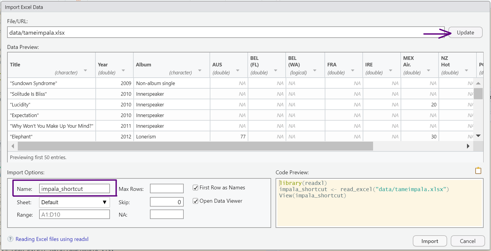

  

This tutorial was designed to help you to boost your confidence in R and RStudio by showing you how you can use RStudio to its full potential with simple tips, tricks and shortcuts! It is supposed to make you feel good about your fresh R skills and works best coupled with a pair of headphones!

### Why do you need this?  

Let me start by saying that R is not the easiest coding language to learn and it might be that just like the rest of us, you are struggling to get a grip on it and need a little boost to help you learn to love it and maybe even make it a little bit of fun. The RStudio is an opensource software used increasingly in data science, but especially because of the characteristics and specificities of the language (don't use spaces in your file names!) is known to drive people crazy, frustrated and overwhelmed - and you might not be the exception! Your workspace may look too busy for you to concentrate or you just want to be a little faster in your command, so you can focus on the actual analysis you were supposed to do in the first place... right?

But remember, even if you're struggling now, eventually even <a href="https://youtu.be/C7VlC0QjdHU?t=38" target="_blank">terrible memories turn into great ones</a> and soon you'll be surprised by your new coding abilities!  

While these tips will not necessarily give you all the quantitative skills to become an experienced data scientist, they will make you feel like one, which is only a step away from the final transformation. With a little bit of luck, this tutorial will make coding less overwhelming and way more enjoyable. The material that I will be sharing are mostly quick fixes to make coding smoother and faster and if it gets too much at any point, you can stop and come back to it when you have more energy! This means the tutorial is friendly for all kinds of working patterns and above all should give you motivation along your coding journey, whether you're a beginner or an experienced coder. It's designed as a resource to help you, so you can work through it on your own terms, one step at a time.

The tutorial is beginner level, but you should be familiar with <a href="https://ourcodingclub.github.io/tutorials/intro-to-r/" target="_blank">R basics</a>. And some of the information can be useful even for intermediate or advanced R users! I organized the tutorial in descending order of usefulness to me (to get your full attention for the essential part!), but everyone's needs are different, so **feel free to skip directly to any of the parts that you think will be most useful to you!**

I am using RStudio version 2021.09.1+372 "Ghost Orchid", but you should be able to follow this tutorial with earlier and later versions as well.


Outline:
- 1. Organizing your RStudio workspace for convenience
  - a) Make your script pane larger
  - b) Set RStudio to never save your workspace image
  - c) Organize script into headings and subheadings
- 2. Using built in shortcuts
  - a) Load libraries with code snippets
  - b) Set your working directory
  - c) Load your data
- 3. Useful packages
  - a) Cleaning column names
  -
- Simple keyboard shortcuts
  - Format your script with one click
- Advanced keyboard shortcuts
  - Create your own functions

- Bonus
- Extra


**(can i toggle different sections?)**

You can download the data that I am using from <a href="https://github.com/EdDataScienceEES/tutorial-sharkie58" target="_blank">this repository</a>, by clicking on `Code` and downloading the zip file. However I encourage you to use this on your own datasets for a more applied and hands-on experience!

### Organizing your RStudio workspace for convenience

#### Make your script pane larger
Let's begin by making your RStudio feel a bit more homey! If you ask me, the original look of the panes all squished together with little space to write in and even less to see is not ideal. Thankfully we can adjust it to work around our needs:

Navigate to the toolbar, click on Tools and choose "Global options...".  
When the following window pops up, choose Pane Layout:
<br>


Here, you can organize your panes to best suit you, but this way works well to make the script panel larger while still having access to everything we need:
- script in top left corner
- console in top right corner
- history in bottom left corner
- everything else (environment, git and plots) in the bottom right panel  

The history panel is rarely used, so we can minimize it and enjoy the extra space!

**insert image**


By the way, you might have noticed the theme of my RStudio is yellow! This is not essential nor good for effective use of RStudio, but a personalized space will always be more enjoyable to work in! See the Extras for multiple ways to personalize your RStudio!

#### Set RStudio to never save your workspace image

One of the things you know, or will undoubtly learn along your R journey, is that the best way to go around saving your work is to save your script either on your computer or even better online using version control such as Github (**click here for a guide on version control**).  
When you save the script, you don't have to save the image of your workplace (i.e. everything in the console) which can take up unnecessary space on your computer.


When this image appears on your screen, you can just press "Don't save", but let me tell you - you will get annoyed by this <a href="https://youtu.be/GHe8kKO8uds?t=94" target="_blank">eventually</a>... Which is why you can set your RStudio to never ask this again!

Click on `Tools` again, select `Global options...` and then `General`. Then you can untick "Restore .RData into workspace at startup" and set saving of .RData on exit to Never. Click OK and the message will never show up again!  


Just remember to save your script regularly!

Now that we've set up RStudio, we can move on to useful shortcuts that can make your analysis faster by typing less.


### 2. Making use of built-in shortcuts

RStudio offers a whole range of options to shorten the amount of code you write, such as using code snippets or running code from the toolbar. Some shortcuts save less time than others so in the following analysis you can try out which ones work best for you!

Let's start our script with some information about us, following the <a href="https://ourcodingclub.github.io/tutorials/etiquette/" target="_blank">coding etiquette</a>.

```
# Your name
# Your email
# Efficient coding in RStudio Tutorial by Sarka Ondrouchova
# accessed at: https://eddatascienceees.github.io/tutorial-sharkie58/
# Date
```

#### Load libraries using code snippets

Code snippets are not only those highlighted excerpts from your code, but are also tools used while writing common code. They can save you lots of time when you get used to them!

Try writing `lib` in your script and <a href="https://youtu.be/odeHP8N4LKc?t=40" target="_blank">let it happen</a>...

  

The code snippet for library is lib and when you press `Enter`, it finishes the word and positions your cursor between the brackets where you need it - less clicking - healthier carpal tunnels!

```
Tip!
You can also use condensed word shortcuts to call functions!
Try typing `instl` and you will discover what coders call fuzzy matching.
It searches by unique letters and not specific words like the well-known Ctrl+F function in text editors.
```
If you're interested in saving time with code snippets, you can check out the <a href="https://support.rstudio.com/hc/en-us/articles/204463668-Code-Snippets" target="_blank">RStudio guide</a> for advanced options or customizing your own snippets!

To be even faster, you can just copy what I used for this analysis - don't worry about these packages, we'll explain them later on! Uncomment (remove the hasthag from) install.packages if it's your first time using them.

```
# Prepare the workspace and data ----
## Load libraries ----
# install.packages("readxl")
# install.packages("janitor")
# install.packages("pacman")

library(readxl) # reads xlsx files
library(janitor) # provides functions to clean your data
library(pacman) # loads and installs packages at the same time
```

#### Set a working directory

Setting a working directory can be one of the initial frustrations and sometimes even the reason why you close RStudio in anger.

While the common guidance is to use forward slashes and make sure you're referring to the correct folder, you can use a more familiar method to do it.

In your `Files` folder, you can click on the three dots `...` and navigate to the desired folder in File Explorer. Choose it and using the button `More`, set it as working directory.

**add image**

**Attention**, this will only run the code in the Console, so for a reproducible piece of work that you can come back to later, you need to copy this part of code from the Console to the Script.

#### Load data

You can similarly avoid typing code to load data, however I would not recommend it as it is probably quicker to type it on your own. If you want to try it out, go to `File` -> `Import Dataset` and choose the appropriate option depending on the source of your file. In our case, we are woking with an .xlxs file, so select `From Excel...`.   



When the new window pops up, fill out the location of the file (remember that we've alreaady set the working directory, so only write the relative path in our directory, in my case the data is in a separate folder "data" in the directory), and the name of the data frame that you want to use.
Notice that RStudio shows the code it uses to load the data in the bottom right corner. This is identical to what we would have used if we wrote it by hand, but will again only show up in the Console. You will have to copy it over to the script to save it for later or for other people to see.

This imported dataset should be the same as the one we imported manually. <a href="https://youtu.be/qLGwIHjhboA?t=113" target="_blank">Is it true?</a>

```
## Load files ----
# 1. manually
impala_manual <- read_excel("data/tameimpala.xlsx")

# 2. shortcut
# The code for shortcut is copied from the console and commented out as we've done this through the toolbar
# > library(readxl)
# > impala_shortcut <- read_excel("data/tameimpala.xlsx")
# > View(impala_shortcut)

# Compare datasets by viewing them from the environment
# Since the datasets are the same, we can use a simpler name
impala <- impala_manual
```

### 3. Useful packages

#### a) Cleaning up your data with janitor

`janitor` is probably my favorite function in the whole R universe. I highly recommend using it if you like to have tidy data frames and to save you time when typing variable names. In one function, it can clean all the names of your column to lowercase and without spaces to adhere to the <a href="https://ourcodingclub.github.io/tutorials/etiquette/" target="_blank">coding etiquette</a> and you will never have to check what letters are uppercase!

Let's see what it can do to the column names of impala!

```
# Efficient use of packages ----
## Clean column names ----
impala_clean <- clean_names(impala)
```
Notice how tidy the data frame looks, plus you won't be having any issues with spaces in column names!

#### b) Loading packages with pacman

Do you remember how we used code snippets to shorten the amount of typing when loading libraries? Well there is an even better option if you're open to install a new package!

`pacman` package includes the function `p_load` which can load multiple packages at once and even install missing ones!

```
## Efficient loading of packages ----
p_load(readxl, janitor, pacman, skimr)
# I added a new package in the mix, skimr - which wasn't installed before!
# p_load loaded all installed packages, and installed and loaded skimr
```

#### c) Data summary using skimr

And now to use the new package we loaded in the previous step. `skimr` is a summary function but provides a very comprehensive output and can even show distribution trends in mini histograms! These are not very applicable to this type of data, however would be very useful for example in summarizing count data of different populations of a species.

```
## skimr to summarize data ----
# First let's organize data in long format instead of wide
impala_long <- gather(impala, country, chart_position,
                      c(aus, bel_fl, fra, ire, mex_air, nz_hot, por, uk, us_rock))
skim(impala_long)
```

### 4. Keyboard shortcuts
Keyboard shortcuts are a great way to reduce the time spent on basic coding. You can view all available shortcuts using `Alt + Shift + K` on Windows or `Option + Shift + K` on Mac, but bellow is my summary of the shortcuts that were most useful to me.

#### a) Simple keyboard shortcuts

| Windows |      Mac      |  Meaning |
|:----------:|:-------------:|:------:|
| Ctrl + S | Cmd + S | Save |
| col 2 is |    centered   |   $12 |
| col 3 is | right-aligned |    $1 |

#### b) Advanced keyboard shortcuts

#### c) Create your own keyboard shortcuts

Compared to the simple ones, these might be <a href="https://youtu.be/_9bw_VtMUGA?t=210" target="_blank">hard to digest</a>, but they are definitely worth it if you have time to understand them!


Bonus: If you're an experienced R user and are frequently using it to create beautiful visualizations that you've learnt in <a href="https://ourcodingclub.github.io/tutorials/dataviz-beautification-synthesis/" target="_blank">one of the Our Coding Club tutorials</a> or elsewhere, it might be useful for you to create an R profile.

Extra: Personalization

Inspiration:
https://towardsdatascience.com/tricks-in-r-to-boost-your-productivity-8c977242c69c


https://stackoverflow.com/questions/15703553/auto-format-r-code-in-rstudio
shortcut for quick formatting (without using a package!)
Ctrl + Shift + A (Windows)
CMD + I (Mac)

https://ourcodingclub.github.io/tutorials/data-manip-efficient/
mention the tutorial on pipes

https://towardsdatascience.com/tricks-in-r-to-boost-your-productivity-part-2-7222461c6671
creating an R profile (ggplot2 theme)
customization of the display

https://www.dataquest.io/blog/rstudio-tips-tricks-shortcuts/
keyboard shortcuts
creating your own function
manage packages with renv

http://pol346.com/r_keyboard_shortcuts.html
create your own keyboard sohrtcuts

let those colours run (breathe deeper)
At the end of the day (no choice)
feels like we only go backwards (oh no not again)
do you remember (one more year)
i'm about to do something crazy (instant destiny)
I HAVE JUST BEEN WAITING FOR THE PERFECT TIME TO TELL YOU (Nothing That Has Happened So Far Has Been Anything We Could Control)
ANOTHER VERSION (yes im changing)
the hardest part is over/the rest gets easy (On Track)

Things to finish:
graphics
packages
keyboard shortcuts
add a script
add copy function to code snippets


I have no more tricks for you today but in the spirit of the data science community, I'd be very happy to hear any feedback or comments, and let me know if you know any other little tweaks that helped you on your journey! I hope I left you feeling motivated to tackle your own coding tasks - after all, the main purpose of this tutorial was to make you feel more confident and cool (cuz only cool kidz listen to tame impala).

Give me a shout at s1861053@ed.ac.uk!


Cover image adapted from: https://favim.com/image/7759092/
