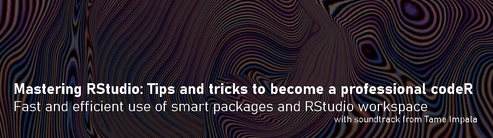
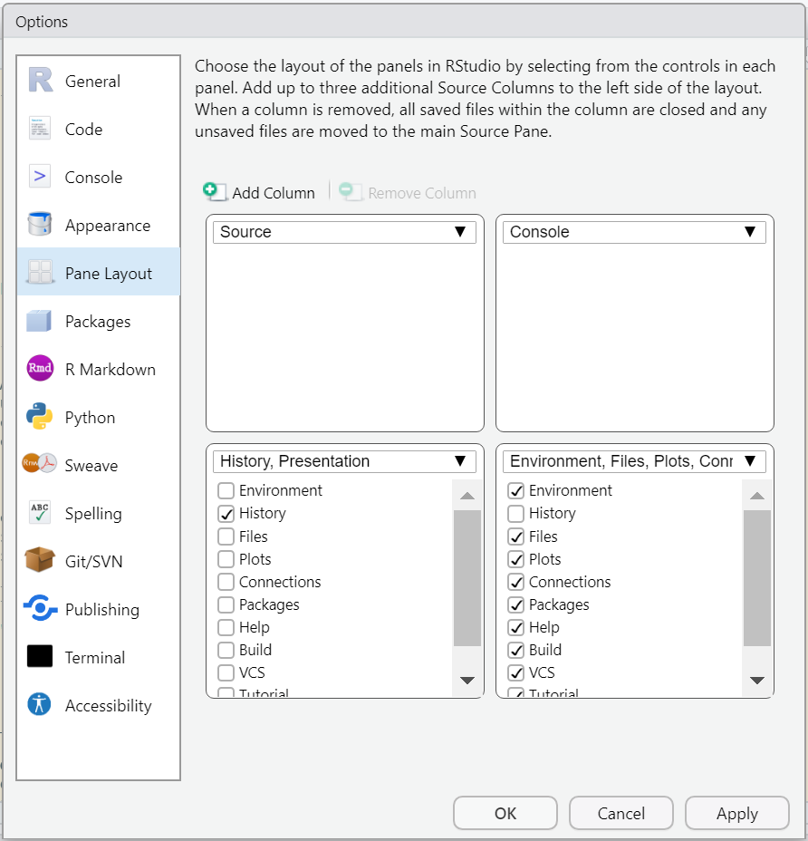
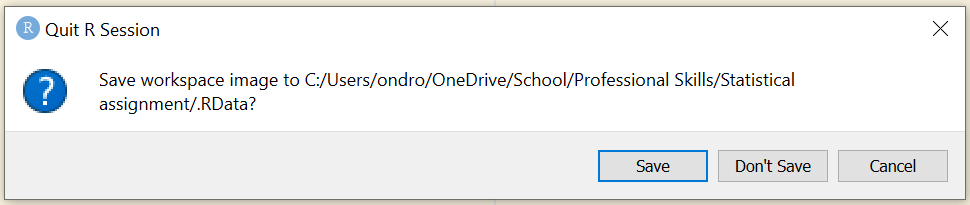
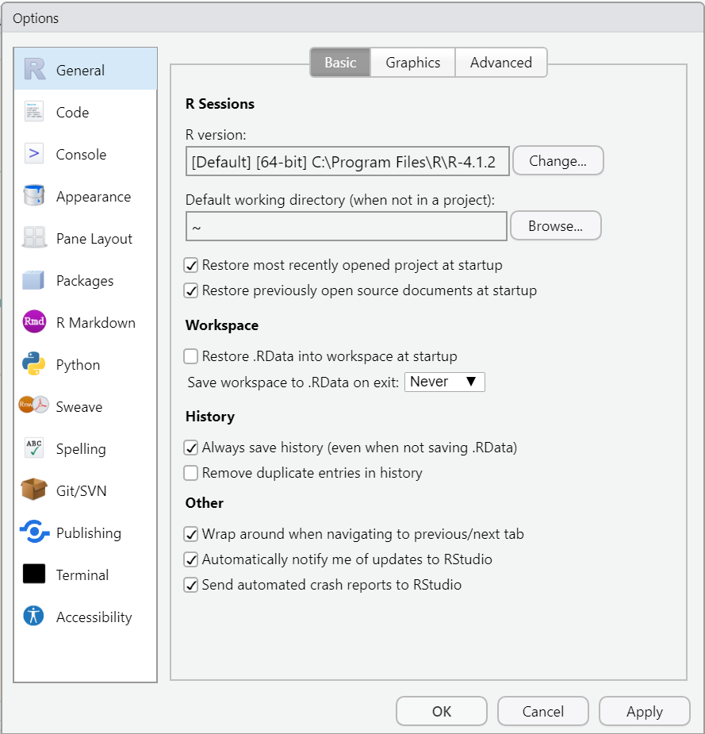
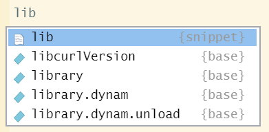

<p style="text-align:center;">  


This tutorial was designed to help you to boost your confidence in R and RStudio by showing you how you can use RStudio to its full potential with simple tips, tricks and shortcuts! It is supposed to make you feel good about your fresh R skills and works best coupled with a pair of headphones!  

  <br>

### Why do you need this?  

Let me start by saying that R is not the easiest coding language to learn and it might be that just like the rest of us, you are struggling to get a grip on it and need a little boost to help you learn to love it and maybe even make it a little bit of fun. The RStudio is an opensource software used increasingly in data science, but especially because of the characteristics and specificities of the language (don't use spaces in your file names!) is known to drive people crazy, frustrated and overwhelmed - and you might not be the exception! Your workspace may look too busy for you to concentrate or you just want to be a little faster in your command, so you can focus on the actual analysis you were supposed to do in the first place... right?

But remember, even if you're struggling now, eventually even <a href="https://youtu.be/C7VlC0QjdHU?t=38" target="_blank">terrible memories turn into great ones</a> and soon you'll be surprised by your new coding abilities!  

While these tips will not necessarily give you all the quantitative skills to become an experienced data scientist, they will make you feel like one, which is only a step away from the final transformation. With a little bit of luck, this tutorial will make coding less overwhelming and way more enjoyable. The material that I will be sharing are mostly quick fixes to make coding smoother and faster and if it gets too much at any point, you can stop and come back to it when you have more energy! This means the tutorial is friendly for all kinds of working patterns and above all should give you motivation along your coding journey, whether you're a beginner or an experienced coder. It's designed as a resource to help you, so you can work through it on your own terms, one step at a time.

The tutorial is introductory level and can be useful to you even if you have only started on your R language learning journey, but contains information that can be useful even for intermediate or advanced R users! I organized the tutorial in order of importance from most important to least (to get your full attention for the essential part!), but everyone's needs are different, so **feel free to skip directly to any of the parts that you think will be most useful to you!**

Specify what version of R im using

Outline:
- Organizing your RStudio workspace for convenience
  - Make your script pane larger
  - Set RStudio to never save your workspace image
  -
- Using built in shortcuts
  - Type less with code snippets
  - Set your working directory and load data without typing
  -
- Useful packages
- Simple keyboard shortcuts
  - Format your script with one click
- Advanced keyboard shortcuts
  - Create your own functions


- Bonus
- Extra

**(can i toggle different sections?)**

You can download the data that I am using from <a href="https://github.com/EdDataScienceEES/tutorial-sharkie58" target="_blank">this repository</a>, by clicking on `Code` and downloading the zip file. However I encourage you to use this on your own datasets for a more applied and hands-on experience!

### 1. Organizing your RStudio workspace for convenience

#### a) Make your script pane larger
Let's begin by making your RStudio feel a bit more homey! If you ask me, the original look of the panes all squished together with little space to write in and even less to see is not ideal. Thankfully we can adjust it to work around our needs:

Navigate to the toolbar, click on Tools and choose "Global options...".  
When the following window pops up, choose Pane Layout:

<p style="text-align:center;">


Here, you can organize your panes to best suit you, but this way works well to make the script panel larger while still having access to everything we need:
- script in top left corner
- console in top right corner
- history in bottom left corner
- everything else (environment, git and plots) in the bottom right panel  

The history panel is rarely used, so we can minimize it and enjoy the extra space!

**insert image**


By the way, you might have noticed the theme of my RStudio is yellow! This is not essential nor good for effective use of RStudio, but a personalized space will always be more enjoyable to work in! See the Extras for multiple ways to personalize your RStudio!

#### b) Set RStudio to never save your workspace image
One of the things you know, or will undoubtly learn along your R journey, is that the best way to go around saving your work is to save your script either on your computer or even better online using version control such as Github (**click here for a guide on version control**).  
When you save the script, you don't have to save the image of your workplace (i.e. everything in the console) which can take up unnecessary space on your computer.

<p style="text-align:center;">

When this image appears on your screen, you can just press "Don't save", but let me tell you - you will get annoyed by this <a href="https://youtu.be/GHe8kKO8uds?t=94" target="_blank">eventually</a>... Which is why you can set your RStudio to never ask this again!

Click on `Tools` again, select `Global options...` and then `General`. Then you can untick "Restore .RData into workspace at startup" and set saving of .RData on exit to Never. Click OK and the message will never show up again!  

Just remember to save your script regularly.

<p style="text-align:center;">


Now that we've set up RStudio, we can move on to useful shortcuts that can make your analysis faster by typing less!

### 2. Making use of built-in shortcuts

RStudio offers a whole range of options to shorten the amount of code you write, such as using code snippets or running code from the toolbar. Some shortcuts save less time than others so in the following analysis you can try out which ones work best for you!

#### a) Code snippets
My favorite shortcuts are code snippets, which I use at the start of any analysis - with loading libraries!  

Code snippets are not only those highlighted excerpts from your script, but are also tools used while writing common code. They can save you lots of time when you get used to them!

Try writing `lib` in your script and <a href="https://youtu.be/odeHP8N4LKc?t=40" target="_blank">let it happen</a>...
<p style="text-align:center;">

The code snippet for library is lib and when you press `Enter`, it finishes the word and positions your cursor between the brackets where you need it - less clicking - healthier carpal tunnels!

```
Tip:
You can also use condensed word shortcuts to call functions!
Try typing `instl` and you will discover what coders call fuzzy matching.
It searches by unique letters and not specific words like the well-known Ctrl+F function in text editors.
```
If you're interested in saving time with code snippets, you can check out the <a href="https://support.rstudio.com/hc/en-us/articles/204463668-Code-Snippets" target="_blank">RStudio guide</a> for advanced options or customizing your own snippets!


#### b) Setting workspace and loading data

### 3. Useful packages

#### a) Cleaning up your data with `janitor`

### 4. Keyboard shortcuts

#### a) Simple keyboard shortcuts

#### b) Advanced keyboard shortcuts

Compared to the simple ones, these might be <a href="https://youtu.be/_9bw_VtMUGA?t=210" target="_blank">hard to digest</a>, but they are definitely worth it if you have time to understand them!


Bonus: If you're an experienced user of R and are frequently using it to create beautiful visualizations that you've learnt in one of the Our Coding Club tutorials or elsewhere, it might be useful for you to create an R profile.

Extra: Personalization

Inspiration:
https://towardsdatascience.com/tricks-in-r-to-boost-your-productivity-8c977242c69c


https://stackoverflow.com/questions/15703553/auto-format-r-code-in-rstudio
shortcut for quick formatting (without using a package!)
Ctrl + Shift + A (Windows)
CMD + I (Mac)

https://ourcodingclub.github.io/tutorials/data-manip-efficient/
mention the tutorial on pipes

https://towardsdatascience.com/tricks-in-r-to-boost-your-productivity-part-2-7222461c6671
creating an R profile (ggplot2 theme)
customization of the display

https://www.dataquest.io/blog/rstudio-tips-tricks-shortcuts/
keyboard shortcuts
creating your own function
manage packages with renv


let those colours run (breathe deeper)
At the end of the day (no choice)
feels like we only go backwards (oh no not again)
do you remember (one more year)
i'm about to do something crazy (instant destiny)

Things to finish:
graphics
packages
keyboard shortcuts
how to make it a website
add a script


I have no more tricks for you today but in the spirit of the data science community, I'd be very happy to hear any feedback or comments, and let me know if you know any other little tweaks that helped you on your journey! I hope I left you feeling motivated to tackle your own coding tasks - after all, the main purpose of this tutorial was to make you feel more confident and cool (cuz only cool kidz listen to tame impala).

Give me a shout at s1861053@ed.ac.uk!


Cover image sourced at: https://favim.com/image/7759092/
